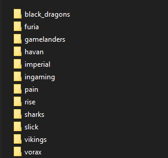
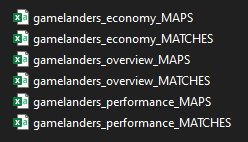

# tcc-deploy
Deploy repo for my CS graduation project on streamlit and python.

# Introdução

## Resumo

O trabalho desenvolvido tem como objetivo aplicar métodos de ciências de dados para extração, processamento e análise de dados no âmbito de esportes eletrônicos, especificamente sobre dados de partidas competitivas de times brasileiros de Valorant. 
Na última década o mercado de e-sports tem crescido ano após ano, tanto em termos de receita e [premiações de campeonatos](https://liquipedia.net/valorant/Portal:Statistics) como em adesão de público em arenas, plataformas de streaming e redes sociais. 
Grandes organizações tem adotado a cultura data driven e o uso de dados no direcionamento de decisões e estratégias para a evolução no cenário
competitivo. 
A metodologia do trabalho consiste na extração e armazenamento local de dados web de partidas competitivas, pré-processamento dos conjuntos de dados e aplicação
de técnicas de análises descritivas para avaliação das principais métricas de performance de times e jogadores. 
Os métodos de análise aplicados permitiram adquirir um melhor conhecimento sobre a natureza dos dados utilizados, quantificar relações entre
atributos numéricos e categóricos e identificar diferenças significativas entre perfis de
combate de jogadores. Os resultados encontrados estão divulgados através de tabelas e diferentes visualizações em uma interface web interativa disponível [neste link](https://share.streamlit.io/gabrielperson/tcc-deploy/main/streamlitapp.py). 

## Contextualização

Na ultima década  a indústria de Jogos Digitais e *E-Sports* tem crescido ano após ano tanto em termos de receita como de jogadores/espectadores, com mais organizações e grandes marcas investindo no mercado e pessoas consumindo mais produtos e assistindo mais campeonatos através de plataformas de *streaming*. 
Aliado ao crescimento desta indústria tem-se a disseminação da cultura [*Data Driven*](https://neilpatel.com/br/blog/data-driven) em diversas outras indústrias no mundo todo, onde decisões de negócio são direcionadas e tomadas baseando-se em estudos e análise de dados e indicadores e não somente em suposições, inferências e experiências.

No meio dos _E-Sports_ esta cultura se estabeleceu através de organizações e times investindo na capacitação de jogadores e comissão técnica, principalmente através de [técnicos e analistas que valorizam e utilizam dados](https://www.hltv.org/news/28332/valens-joins-evil-geniuses-as-head-of-data-science) em tomadas de decisão e estratégias e a adoção de plataformas como [shadow.gg](https://shadow.gg) e [mobalytics.gg](https://mobalytics.gg) que utilizam dos dados gerados pelo próprios jogadores em partidas para gerar análises das principais métricas de performance auxiliando os jogadores no estudo de adversários, adoção das melhores estratégias e minimização de falhas.

O desenvolvimento dessa interface se motiva nos métodos de análises de dados utilizados por essas plataformas e demais aplicações de ciências de dados e na importância de sua utilização e divulgação à comunidade para a evolução dos _E-Sports_ em alto nível.

## Objetivos

### Obetivos Gerais:

O trabalho desenvolvido ao longo do POC I e POC II (Projeto Orientado a Computação) tem como objetivo a aplicação de técnicas de mineração de dados e [KDD (Knowledge Discovery in Data)](https://pt.wikipedia.org/wiki/Extração_de_conhecimento) sobre os dados de partidas de times brasileiros disponíveis publicamente no website [www.vlr.gg](https://www.vlr.gg), 
desenvolvimento de análises exploratórias e estatísticas sobre os dados coletados e a divulgação dos principais resultados e métricas de performance em uma interface web disponível à toda comunidade. O relatório desenvolvido e divulgado como entrega do POC I pode ser encontrado na pasta 'docs' disponível no repositório github deste projeto e baixado [aqui.](https://github.com/GabrielPerson/tcc-deploy/raw/main/docs/POC%201%20-%20GABRIEL%20PERSON.pdf)

### Objetivos Específicos:

- Extração dos dados através de técnicas de [Web Scraping](https://pt.wikipedia.org/wiki/Coleta_de_dados_web) e armazenamento em arquivos locais.

- Avaliação de métricas de performance inerentes ao jogo através de técnicas de análises descritivas e estatísticas.

- Desenvolvimento de uma interface web para a divulgação dos dados, análises e visualizações desenvolvidas para a comunidade brasileira e internacional.

# Metodologia

## Fonte de Dados

Os dados utilizados no desenvolvimento do trabalho foram extraídos do website [www.vlr.gg](https://www.vlr.gg) considerado um dos maiores portais de divulgação de conteúdo e resultados do cenário competitivo de Valorant mundial, disponibilizando resultados
de partidas, estatísticas de times e jogadores, ranqueamento de times por cada região de
disputa, fóruns de discussão e notícias recentes sobre times e jogadores. 

_Disclaimer_: Os dados utilizados estão sujeitos à qualidade e disponibilidade destes no próprio website. 

## Extração e Armazenamento dos Dados

Para a extração dos dados de cada partida são utilizadas as bibliotecas [Urllib](https://docs.python.org/3/howto/urllib2.html), [Beautiful Soup](https://www.crummy.com/software/BeautifulSoup/bs4/doc) e [Pandas](https://pandas.pydata.org/pandas-docs/stable/index.html), onde cada página de interesse é acessada através de uma URL (Uniform Resource Locator)
específica para cada série de partidas disputadas entre dois times e para cada partida são
extraídos dados de interesse das abas [Overview](https://www.vlr.gg/51296/acend-vs-gambit-esports-valorant-champions-2021-gf/?game=57981&tab=overview), [Performance](https://www.vlr.gg/51296/acend-vs-gambit-esports-valorant-champions-2021-gf/?game=57981&tab=performance) e [Economy](https://www.vlr.gg/51296/acend-vs-gambit-esports-valorant-champions-2021-gf/?game=57981&tab=economy), previamente
nomeadas pelos criadores do portal. A figura abaixo exemplifica como os dados são dispostos
na aba __Overview__.

As informações de desempenho dos jogadores para a série e cada mapa dispostas em
formato de tabelas _html_ são extraídas utilizando-se a função **read_html** da biblioteca
Pandas, que identifica automaticamente os dados dessas tabelas e armazena em estruturas
do tipo **Dataframes** no ambiente de execução. As demais informações dispostas na página,
como rodadas vencidas por cada time, mapas disputados, versão do jogo e agentes utilizados
são acessados e extraídos através de suas respectivas tags *html* e armazenados em listas e
variáveis de ambiente.

Os dados brutos extraídos passsam por uma etapa de pré-processamento para o tratamento de valores nulos, conversão de valores e criação de novos atributos para serem armazenados em arquivos do tipo _csv (comma separated value)_. Os dados comportam as partidas oficiais e indexadas pelo **vlr.gg** dos principais times brasileiros a partir do mês de Setembro de 2020. Embora existam partidas oficiais datadas
de desde Junho de 2020, mês do lançamento oficial de Valorant , essas partidas não
possuem informações suficientes disponíveis no website, portanto foram desconsideradas.

## Análise de Dados

O processo de análises exploratórias e estatísticas foi
conduzido com a intenção de prover melhores visualizações e conhecimento sobre os dados
utilizados no desenvolvimento do trabalho, através de correlações de atributos, quantidades
absoluta de ocorrências de valores, estatísticas descritivas - média, mediana, quartis, etc... - e distribuição dos dados

As análises foram conduzidas utilizando-se funções disponíveis nas bibliotecas Pandas, [Scipy](https://docs.scipy.org/doc/scipy/reference/index.html) e [Seaborn](https://seaborn.pydata.org/index.html), sendo as primeiras utilizdas em manipulações e análises
descritivas e a última na geração de gráficos para visualização dos dados
em diferentes contextos, como gráficos de dispersão, densidade, quantidade, distribuição e correlação dos dados

O repositório github contendo a maior parte do código utilizado na extração dos dados e desenvolvimento das análises se encontra [neste link](https://github.com/GabrielPerson/vlrgg-analytics)

## Interface Wenb

Esta interface web foi desenvolvida com o propósito de divulgar as análises e estudos desenvolvidos sobre a base de dados extraida. Após pesquisas sobre os principais _framworks_ Python de desenvolvimento web (Django, Flask, etc...), foi escolhido o **[Streamlit](https://streamlit.io)**, principalmente por ser muito utilizado no desenvolvimento de aplicativos voltados para a divulgação de trablalhos sobre dados. Sua simplicidade e robustez possibilitou a migração de funções já desenvolvidas anteriormente no curso do trabalho para tratamento e visualização dos dados.

O suporte do _framework_ à linguagem **Markdown** facilita a escrita de textos explicativos sobre o trabalho que visam o melhor entendimento do usuário. Tem-se o também o suporte a diversas ferramentas de divulgação de interação do usuário com os dados e visualizações disponíveis, como visualização e _download_ de tabelas de dados e filtros de seleções de valores (multiseletores, _sliders_), podendo ser facilmente incluídos na interface, não necessitando de um grande conhecimento e de linguagens específicas de desenvolvimento web como _JavaScript_, além de tornar a experiência do usuário muito mais completa e interativa.

# Resultados

## Base de Dados

Um dos principais resultados alcançados no desenvolvimento do trabalho foi a estruturação de uma base de dados extraídos do website [www.vlr.gg](https://www.vlr.gg) composta pelas partidas disputadas pelos principais times brasileiros de Valorant, uma vez que não há a possibilidade de se obter esses dados diretamente com a desenvolvedora Riot Games através de uma API pública.

Desde o ínicio do desenvolvimento do trabalho a base de dados tem sido constatemente atualizada com as partidas dos principais times do país a partir de Setembro de 2020 e atualmente é composta por diretórios separados por times - como ilustrado abaixo - e por conjuntos de dados gerais de times e jogadores, combinados de todos os arquivos, estes contendo respectivamente 900 e 5300 linhas atualmente.

## Interface Web

Como extensão do trabalho realizado do POC I foi desenvolvida esta interface web para a divulgação não somente do conjunto de dados utilizado mas também das principais análises desenvolvidas sobre os diversos atributos presentes nas bases.

A priorização do desenvolvimento de uma interface web de fácil divulgação e acessibilidade sobre o desenvolvimento de um artigo visa promover a acessibilidade e interação da comunidade de Valorant - jogadores casuais, profissionais, técnicos, analistas e criadores de conteúdo - com toda a informação e conhecimento desenvolvido sobre os dados e análises. Esta com o principal objetivo que as informações divulgadas possam contribuir para a evolução técnica e tática do cenário competitivo e na conquista de diversos títulos internacionais juntamente aos jogadores brasileiros vitoriosos em diversos outros jogos competitivos.

# Conclusão

## Principais Desafios

Todo este trabalho desenvolvido começou com um lapso de curiosidade de um intusiasta de dados e ávido jogador de Valorant sobre a viabilidade de obtenção e análises de dados de partidas competitivas. Desde então a principal dificuldade encontrada no decorrer do desenvolvimento foi a acessibilidade dos mais diversos dados disponíveis online, seja por páginas com dados incompletos ou pela inerente dificuldade de obtenção de dados através de métodos de Web Scraping, onde muitas das informações devem ser obtidas através do acesso de tags HTML muito específicas em uma página pondendo levar a diversas inconsitências através das centenas de páginas que devem ser acessadas e mineradas.

Grande parte dessa principal dificuldade foi mitigada por experiência prévia em aplicação de técnicas de Web Scaraping em demais projetos de pesquisa densvolvidos ao longo da graduação e pelo fácil acesso a parte dos dados presentes em tabelas HTML através de funções da biblioteca Pandas após uma sucinta análise da estrtura e distribuição das principais informações no website.

## Evolução do Trabalho

O trabalho desenvolvido até aqui pode ser evoluido em diversos aspectos, sendo o principal deles a viabilidade da extração de milhares de partidas competitivas das diversas regiões do mundo, uma vez que as páginas contendo as informações de cada partida podem ser acessadas através de links no formato "http://vlr.gg/<id_partida>", porém sendo necessárias alterações nos códigos responsáveis pelo acesso e extração dos dados para a identificação  e mitigação de diversas inconsistencias que possam surgir.

Ao ser possível o acesso e extração de dezenas de milhares de partidas competitivas essas informações podem ser armazenadas publicamente em bancos de dados de serviços de nuvem, possibilitando o fácil e rápido acesso por praticamente todos os entusiastas de Valorant para o desenvolvimento de diversas soluções baseadas em dados e futuros estudos.

As referências utilizadas para o desenvolvimento deste trabalho se encontram disponíveis através de _hiperlinks_ na documentação referentes a métodos, bibliotecas utilizadas e fontes externas de informação.
